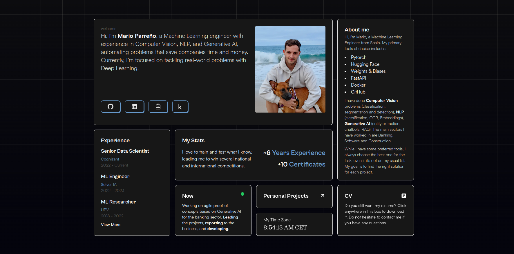

# ⚡️astro-bento-portfolio

## A personal portfolio website made using `Astro`.



# Steps ▶️

```bash
# Clone this repository
$ git clone https://github.com/MarioProjects/bento_personal_website
```

```bash
# Go into the repository
$ cd bento_personal_website
```

```bash
# Install dependencies
$ pnpm install
or
$ npm install
```

```bash
# Start the project in development
$ pnpm run dev
or
$ npm run dev
```


# Configuration

remember to replace the `site` and other properties with your data in `astro.config.mjs`

# Deploy

We are using Docker to deploy the project, so you need to have Docker installed on your machine.

```bash
# Build the image
docker build -t bento-personal-site:latest .
docker run -d -p 9001:8080 --name bento-personal-site bento-personal-site
```

## Acknowledgements

- Gianmarco - https://github.com/Ladvace
- Dark Theme - https://www.tohuwabohu.io/2022/11/astrojs-theme-toggle
